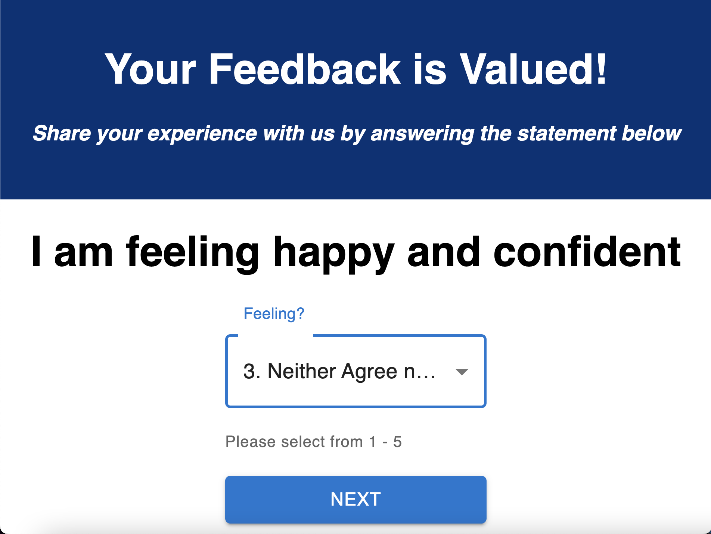
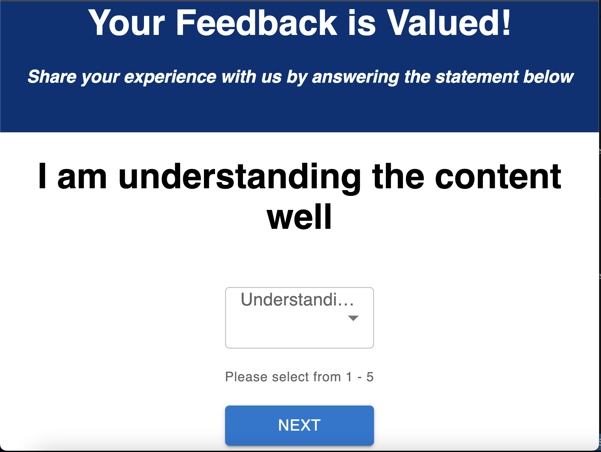
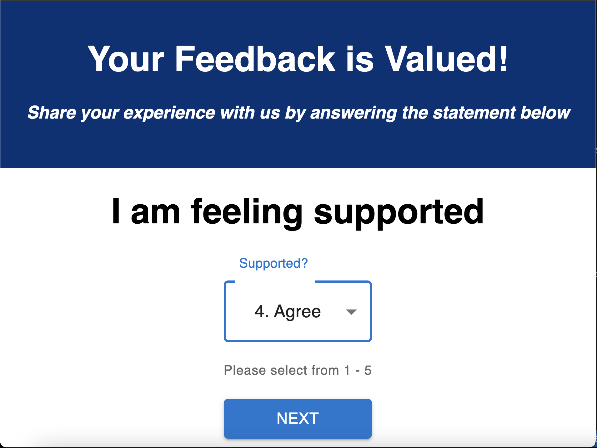

# Redux Feedback Loop

This project is a reflection/feedback form system. Feedback is collected over 4 views. In a separate review page, it displays the current feedback values and it is submited with a button. When all steps are complete, the app saves the feedback in the database. 

This is a system built using mulitple components.

### SETUP

Create your database and tables using the provided `data.sql` file. Start the server.

```
npm install
npm run server
```

Now that the server is running, open a new terminal tab with `cmd + t` and start the react client app.

```
npm run client
```

### ADD NEW FEEDBACK

the system is a multi-part form that allows users to leave feedback for today. 
There is 4 views for the form parts.

The parts:
- Home page

- How are you feeling today?

- How well are you understanding the content?

- How well are you being supported?

- Any comments you want to leave?


There is no nav bar, each part of the form has its own route. Clicking next move the user to the appropriate step in the process.

## THE REVIEW COMPONENT

The last step of the process allows the user to review their feedback.


## SUBMIT THE FEEDBACK

The `Review` step has a submit button which completes the feedback to the server.

When the submit button is clicked, save the submission in the database. The user can see a submission success page. They can then click the button to take a new survey.


## Credits

This project was based on an activitie from Prime Academy.